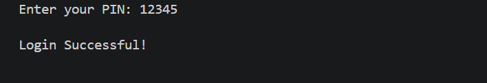
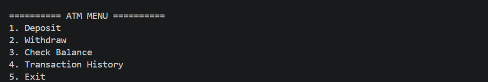
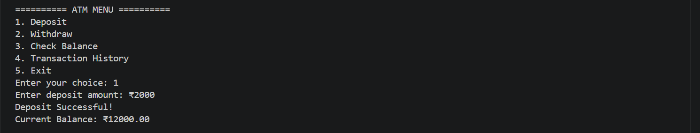
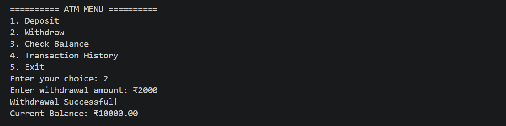
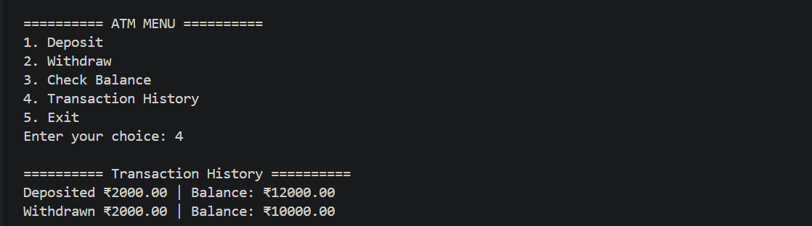

# ATM Machine Simulation 


## About The Project
A simple ATM Machine project developed using **Python** and **Object-Oriented Programming (OOP)**. This application simulates the core functionalities of an ATM, including PIN authentication, deposits, withdrawals, balance inquiry, and transaction history with proper exception handling.

---

##  Features

-  Secure PIN Authentication
-  Deposit Money
-  Withdraw Money
-  Check Account Balance
-  View Transaction History
-  Exception Handling
-  Clean and Modular OOP Design

---

##  Technologies Used

- Python 3
- Object-Oriented Programming (OOP)
- Exception Handling

---

## 📂 Project Structure

```
ATM-Machine/
│── atm.py
│── README.md
│── login.png
│── menu.png
│── deposit.png
│── withdraw.png
│── history.png
```

---

##  How to Run

1. Clone this repository

```bash
git clone https://github.com/lakshmi1810-create/ATM-Machine.git
```

2. Navigate to the project folder

```bash
cd ATM-Machine
```

3. Run the program

```bash
python atm.py
```

---
##  Project Screenshots

###  Login Screen


###  ATM Menu


###  Deposit Money


###  Withdraw Money


###  Transaction History

---
## 💡 Key Learning

- Object-Oriented Programming (OOP)
- Exception Handling in Python
- User Input Validation
- Real-world project structuring
---

##  Future Enhancements

-  Multiple User Accounts
-  Database Integration (SQLite/MySQL)
-  GUI using Tkinter
-  Encrypted PIN Storage
-  Receipt Generation

---

##  Contributing

Contributions are welcome! Feel free to fork this repository, improve the project, and submit a pull request.

---

##  Author

**Lakshmi Chauhan**  
Python Developer | OOP Learner  
🔗 https://github.com/lakshmi1810-create

---

 If you like this project, don't forget to give it a star ⭐  on GitHub!
